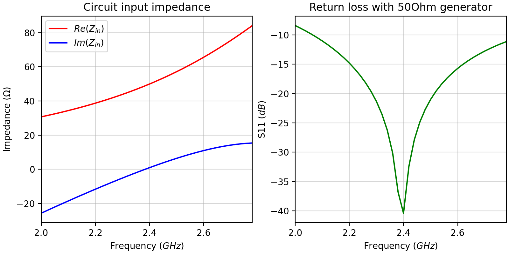
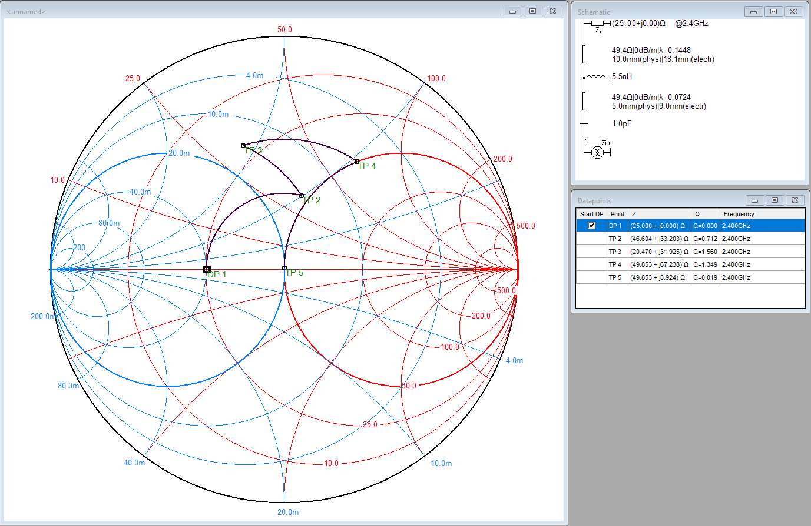

# RFanalyzer
A python tool for analyzing the impedance and return loss of an RF circuit

# Installation
Firstly, clone to your machine.
```bash
git clone git@github.com:byggemandboesen/RFanalyzer.git
```

The library only relies on Numpy except if you will also be using the ```Touchstone``` class in which case you also need ````scikit-rf```.

```bash
pip install scikit-rf
```

# Example
The example below, shows the analysis of matching circuit for a 25Ohm antenna to a 50Ohm generator at 2.4GHz. <br>
This is done using both series and parallel components to highlight the capabilities of the library.

```python
import numpy as np

from RFanalyzer import Circuit, Stackup
from RFanalyzer.transmission_lines import Microstrip
from RFanalyzer.lumped_components import Resistor, Inductor, Capacitor
from RFanalyzer.loads import Load, Open, Short

# Define PCB stackup
su = Stackup(er=4.3, ur=1, h=0.5)
# Define microstrip width
ms_w = 1
# Define analysis frequency
f = np.arange(start=2, stop=2.8, step=0.02)*10**9

# Build circuit
components = [
    [Capacitor(capacitance=1*10**(-12))], # 1pF series capacitor
    [Microstrip(length=5, width=ms_w)], # 5mm series microstrip line
    [None, Inductor(inductance=5.5*10**(-9)), Short()], # 5.5nH parallel inductor to ground
    [Microstrip(length=10, width=ms_w)],
    [Load(25*np.ones_like(f, dtype=np.complex128))] # Antenna (assuming constant 25Ohm across frequency range)
]
circuit = Circuit(components=components, stackup=su)

# Compute circuit input impedance and return loss using a 50Ohm generator
Z_in = circuit.inputImpedance(f=f)
s11 = circuit.returnLoss(f=f, Z_source=Load(impedance=50))
```

Plotting these results yields the performance shown below.


The circuit above can be seen below using [Smith V4.1](http://www.fritz.dellsperger.net/smith.html).



# TODO
* Automatically optimize matching component values
* Monte Carlo sensitivity analysis
* Add simple distributed elements